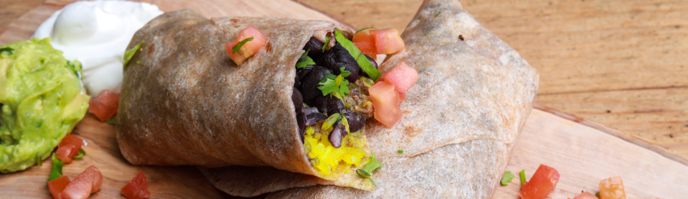

# RecipeNet

This neural network can tell you which other ingredients you can add to your cooking recipes to improve them. It's trained on the [simplified-recipes-1M dataset](https://dominikschmidt.xyz/simplified-recipes-1M) which differentiates between 3500 different ingredients.  
You can read the full article [here](https://dominikschmidt.xyz/recipe-net).

For example, using this (partial) ingredient list for maki (sushi) as input [`salt`, `sugar`, `rice`, `cucumber`, `nori`, `sushi rice`], the network successfully suggests fitting ingredients including common fillings like `avocado`, `salmon` and `cucumber`. 

_(top 14 out of 3500 known ingredients shown, parenthesized ingredients are similar to one or more ingredients in the input and are not helpful and not hard to guess for the network)_

| Ingredient           | confidence | fitting? | notes                                     |
| -------------------- | ---------- | -------- | ----------------------------------------- |
| (`seaweed`)          | 0.131      | X        | to wrap the maki                          |
| `water`              | 0.081      | X        | for cooking the rice                      |
| `mayonnaise`         | 0.028      | X        | not in traditional maki, but not uncommon |
| `avocado`            | 0.025      | X        | as a filling                              |
| (`nori`)             | 0.025      | X        | seaweed - to wrap the maki                |
| `salmon`             | 0.018      | X        | as a filling                              |
| `wasabi`             | 0.015      | X        | maki is commonly served with wasabi       |
| `roe`                | 0.013      | X        | for ikura maki                            |
| `lettuce`            | 0.013      |          |                                           |
| `vinegar`            | 0.010      | X        | for sumeshi (vinegared sushi rice)        |
| `eggs`               | 0.010      | ~        | maybe for the mayonnaise?                 |
| (`sushi rice`)       | 0.008      | X        |                                           |
| `egg`                | 0.007      | ~        | same as eggs                              |
| (`english cucumber`) | 0.006      | X        | as a filling                              |

In other training attempts the model also suggested `crab sticks`, `ginger` and `mango`.

For the (partial) burrito recipe [`peppers`, `rice`, `tortillas`, `black beans`, `flour tortillas`, `guacamole`] the model suggested many common burrito ingredients, but also less common ones like `mozzarella cheese` and `corn`.

| Ingredient          | confidence | fitting? | notes                        |
| ------------------- | ---------- | -------- | ---------------------------- |
| (`black`)           | 0.868      | /        | ingredient cleaning artifact |
| `salt`              | 0.098      | X        | seasoning                    |
| `onion`             | 0.057      | X        | vegetables                   |
| (`bell peppers`)    | 0.038      | X        | vegetables                   |
| `corn`              | 0.035      | X        | vegetables                   |
| `chicken`           | 0.026      | X        | meat                         |
| `seasoning mix`     | 0.021      | X        | seasoning                    |
| `oil`               | 0.021      | X        | oil                          |
| `cheese`            | 0.020      | X        | cheese                       |
| (`red peppers`)     | 0.020      | X        | vegetables                   |
| `salsa`             | 0.018      | X        | seasoning                    |
| (`green peppers`)   | 0.013      | X        | vegetables                   |
| `onions`            | 0.013      | X        | vegetables                   |
| (`chili peppers`)   | 0.007      | X        | vegetables                   |
| `mozzarella cheese` | 0.007      | X        | cheese                       |
| `water`             | 0.007      | X        | for cooking the rice         |

In other training attempts the model also suggested `ground beef` and `salt`.

For the fairly basic vegetables and rice recipe [`salt`, `pepper`, `tomatoes`, `carrots`, `oil`, `seasoning`, `rice`, `bell peppers`, `vegetables`, `spices`] the network suggested adding many other kinds of vegetables and also chicken. 

| Ingredient             | confidence | fitting? | notes      |
| ---------------------- | ---------- | -------- | ---------- |
| (`peppers`)            | 0.935      | X        | vegetables |
| `onion`                | 0.225      | X        | vegetables |
| `onions`               | 0.176      | X        | vegetables |
| `chicken`              | 0.099      | X        | meat       |
| (`green bell peppers`) | 0.082      | X        | vegetables |
| (`mixed vegetables`)   | 0.065      | X        | vegetables |
| `cauliflower`          | 0.056      | X        | vegetables |
| `zucchini`             | 0.056      | X        | vegetables |
| (`italian seasoning`)  | 0.049      | X        | seasoning  |
| `sugar`                | 0.048      |          |            |
| `celery`               | 0.033      | X        | vegetables |
| `water`                | 0.030      | ~        |            |
| `garlic`               | 0.027      | X        | seasoning  |
| (`black pepper`)       | 0.022      | X        | seasoning  |

## How to use
(skip to step 4 if you already have a `recipes.npz` file and do not wish to regenerate the dataset with different parameters)

1. Manually download the three used Kaggle datasets as described in the second cell in `recipeprep.ipynb`
2. Use `recipeprep.ipynb` to download all other datasets and extract, merge, process and clean all of them. Here all used datasets get unified, messy ingredient strings get stripped of non-alpha chars and similar ingredients get merged. This step creates a ~200MB file `data.pickle` that contains preprocessed recipe and ingredient data.
3. Use `ingredient_extract.ipynb` to further clean and simplify ingredients. This is necessary since ingredients are initially in a bad format (like '1 1/2 lbs of chicken breasts' or 'a finely blended 2:3 mix of greek yoghurt and milk' instead of 'chicken' or ['yoghurt', 'milk']). This step creates a ~60MB file `recipes.npz` containing simplified recipe-ingredient-lists using the most common 3500 ingredients. This can take up to two hours.
4. Use `recipenet.ipynb` to train or load the neural network and make predictions. Training for 4-8 epochs takes 15-30 minutes on an NVIDIA RTX 2080 Ti GPU depending on the selected architecture.

- `hparam_tune.py` contains code for hyperparameter optimation with TensorBoard
- `util.py` contains code for loading and managing the dataset during training
- `setup.sh` contains code for setup on a remote server
- `recipenet_saved_model.zip` contains a saved_model (training from scratch is recommended)
